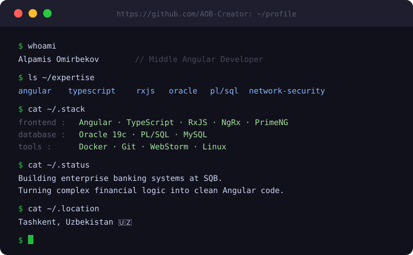

## 💫 About Me

- 🏦 **Middle Frontend Developer** at **SQB (O'zsanoatqurilishbank)** — building banking core ABS platforms
- ⚙️ Specializing in **Credits, Loans, Guarantees, Cards, CRM & KYC** modules
- 🗄️ **Oracle 19c / PL/SQL** database engineer with banking schema design experience
- 🔐 Passionate about **Network Security** and infrastructure
- 🎓 **Master's Student** at **Bank and Finance Academy (BFA) of Uzbekistan** — Project Management
- 🚀 Targeting **Team Lead** and **IT Project Manager** roles in fintech & banking
- 📍 Tashkent, Uzbekistan

## 🧠 Languages & Tools

  <!-- Frontend -->
  
  
  
  
  

  <!-- Database -->
  

  <!-- Backend -->
  

  <!-- Tools -->
  
  
  
  
  
  
  
  
  
  

## 📊 GitHub Stats

  

## 🏆 LeetCode

